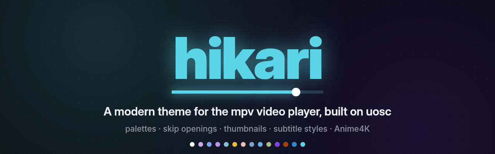
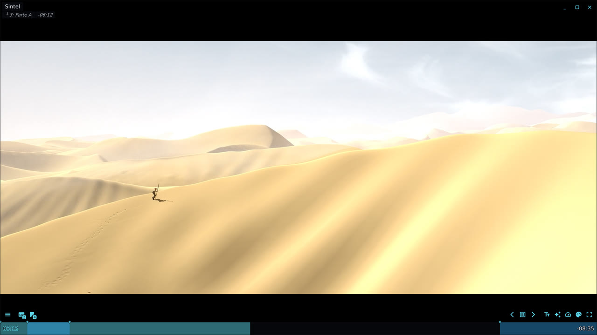
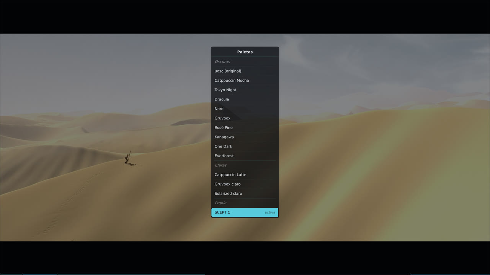
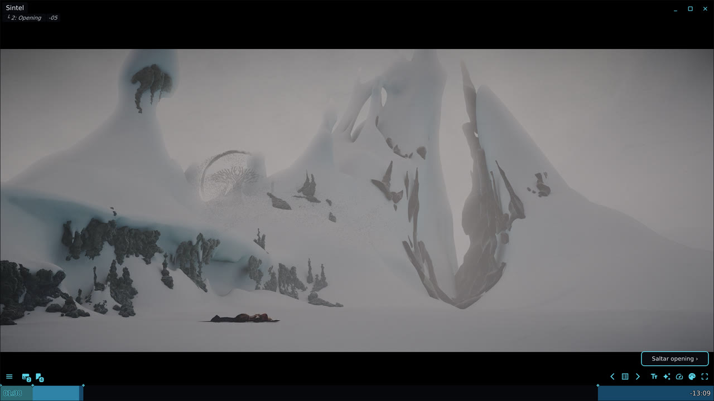
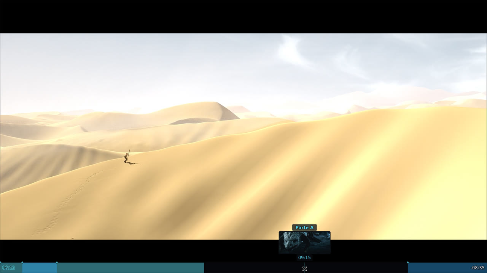
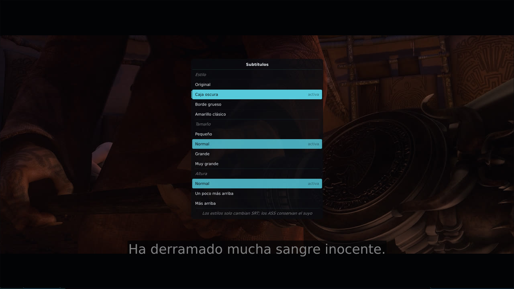
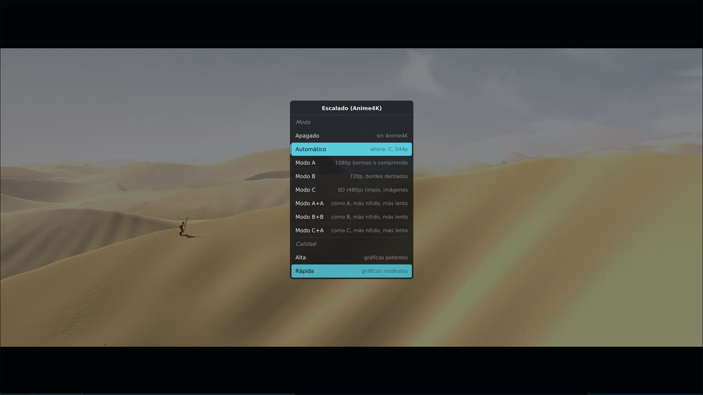

<div align="center">



[](https://github.com/SCEPTICG/hikari-mpv/releases/latest)
[](LICENSE)
[](#quick-install)
[](https://scepticg.github.io/hikari-mpv/)
[](https://github.com/tomasklaen/uosc)

**A modern theme for the [mpv](https://mpv.io) video player, built on [uosc](https://github.com/tomasklaen/uosc).**<br>
14 colour palettes · skip openings and endings · timeline thumbnails · subtitle styles · automatic Anime4K upscaling<br>
installed with one command on Windows, macOS and Linux

[Quick install](#quick-install) · [What you get](#what-you-get) · [Screenshots](#screenshots) · [**Documentation**](https://scepticg.github.io/hikari-mpv/)

</div>

hikari is a *skin* for mpv in the sense people usually mean: a ready-made, good-looking setup for watching series and anime, not a new on-screen controller written from scratch. It installs the official [uosc](https://github.com/tomasklaen/uosc) and [thumbfast](https://github.com/po5/thumbfast), configures them, and adds a few small Lua scripts of its own on top. Everything it changes in your config folder is backed up first, and it can be uninstalled.

https://github.com/user-attachments/assets/de84639c-2a86-45aa-b26d-b40d31ae2f42

<sub>A one-minute showreel, drawn frame by frame in code; the Anime4K comparison is a real render in mpv. Footage and audio: *Demon Slayer: Kimetsu no Yaiba*, episode 19 © Koyoharu Gotōge / Shueisha, Aniplex, ufotable, used only to demonstrate the player. hikari is not affiliated with them.</sub>

## What you get

- **14 colour palettes**: Catppuccin Mocha and Latte, Tokyo Night, Dracula, Nord, Gruvbox (dark and light), Rosé Pine, Kanagawa, One Dark, Everforest, Solarized light, uosc's original and hikari's own, SCEPTIC. Picked from a menu (`Alt+p`) and applied straight away.
- **Your language**: hikari's menus, buttons and messages in English, Spanish, German, French, Italian, Polish, Portuguese, Romanian, Russian, Turkish, Ukrainian and Chinese (Simplified and Hong Kong), the languages of uosc. It follows your system, and `Alt+l` changes it; uosc follows along, and so do the audio and subtitle tracks mpv picks (your dub, otherwise Japanese with your subtitles).
- **Skip openings and endings**: a *Skip opening ›* button while a chapter looks like an opening, intro or ending; one click or `Alt+s` jumps to the next chapter.
- **Timeline thumbnails** through thumbfast, on network streams too.
- **Subtitle styles**: *Dark box* (Netflix-like), *Thick outline* (Crunchyroll-like), *Classic yellow*, plus size and height (`Alt+t`).
- **Anime4K upscaling**: an *Upscaling* menu and `Ctrl+0`–`Ctrl+7` for [Anime4K](https://github.com/bloc97/Anime4K)'s modes, including *Automatic*, which picks the mode from each video's resolution, with a quality that suits your graphics card.
- **Readable titles**: `[SubsPlease] Sousou no Frieren - 05 (1080p) [ABCD1234].mkv` shows as `Sousou no Frieren · E05`, for local files and for links from Seanime and similar apps (with the access token kept out of the title bar). Seasons, specials and episode titles too.
- **Speed menu**: fixed speeds from 0.5× to 2× instead of a slider.
- **A controls bar made for single episodes**: a filled timeline with the opening and ending marked, and hikari's own buttons.
- **Update check**: a short notice and a button when a new hikari version is out. It never updates anything by itself, and it can be turned off.
- **A careful installer**: finds mpv, mpv.net and AnimeJaNai, backs up first, verifies every download against its SHA256, sets aside clashing interfaces such as ModernX, and puts everything back on uninstall.

The installer itself speaks English or Spanish, following your system.

## Quick install

**Windows** (PowerShell, no administrator rights):

```
irm https://github.com/SCEPTICG/hikari-mpv/releases/latest/download/hikari.ps1 | iex
```

**macOS and Linux** (Terminal, no `sudo`):

```
curl -fsSL https://github.com/SCEPTICG/hikari-mpv/releases/latest/download/hikari.sh | bash
```

A menu opens: choose *Install or update* and the player. Run the same line again to update or to uninstall. Requirements, options and how to check the installer before running it: [Install on Windows](https://scepticg.github.io/hikari-mpv/install/windows/) and [Install on macOS and Linux](https://scepticg.github.io/hikari-mpv/install/macos-linux/).

## Screenshots

<table>
  <tr>
    <td width="50%"><br><sub><b>The player</b>: filled timeline with chapters, title bar and hikari's buttons (SCEPTIC palette).</sub></td>
    <td width="50%"><br><sub><b>Palettes</b> (<code>Alt+p</code>): 14 palettes, applied at once.</sub></td>
  </tr>
  <tr>
    <td><br><sub><b>Skip opening ›</b>: shown during openings, intros and endings.</sub></td>
    <td><br><sub><b>Thumbnails</b> on hover, with the chapter name.</sub></td>
  </tr>
  <tr>
    <td><br><sub><b>Subtitle styles</b> (<code>Alt+t</code>): style, size and height.</sub></td>
    <td><br><sub><b>Upscaling</b>: Anime4K modes, with <i>Automatic</i> by resolution.</sub></td>
  </tr>
</table>

<sub>Screenshots of the real player on Linux, with hikari in Spanish, with <a href="https://durian.blender.org/">Sintel</a> © Blender Foundation (CC BY 3.0).</sub>

## hikari and other mpv themes

- **[uosc](https://github.com/tomasklaen/uosc)** is the on-screen controller hikari is built on. If you already use uosc, hikari is a configuration plus a few scripts on top of it, not a fork: your uosc stays the official one, and uosc's own updates keep working.
- **[ModernX](https://github.com/cyl0/ModernX) and [ModernZ](https://github.com/Samillion/ModernZ)** are other replacements for mpv's built-in OSC. They clash with uosc, so the installer sets them aside (nothing is deleted) and puts them back on uninstall.
- **mpv.net and AnimeJaNai** are supported on Windows: hikari installs into the config folder each of them reads.

## Documentation

The full manual lives at **[scepticg.github.io/hikari-mpv](https://scepticg.github.io/hikari-mpv/)**:

- **Install**: [Windows](https://scepticg.github.io/hikari-mpv/install/windows/) · [macOS and Linux](https://scepticg.github.io/hikari-mpv/install/macos-linux/)
- **Use**: [Keys and configuration](https://scepticg.github.io/hikari-mpv/usage/) · [Palettes](https://scepticg.github.io/hikari-mpv/features/palettes/) · [Skip openings and endings](https://scepticg.github.io/hikari-mpv/features/skip/) · [Thumbnails](https://scepticg.github.io/hikari-mpv/features/thumbnails/) · [Subtitle styles](https://scepticg.github.io/hikari-mpv/features/subtitles/) · [Anime4K upscaling](https://scepticg.github.io/hikari-mpv/features/anime4k/) · [Titles](https://scepticg.github.io/hikari-mpv/features/titles/) · [Speed menu](https://scepticg.github.io/hikari-mpv/features/speed/) · [Languages](https://scepticg.github.io/hikari-mpv/features/language/) · [Update check](https://scepticg.github.io/hikari-mpv/features/update-check/)
- **Help**: [FAQ](https://scepticg.github.io/hikari-mpv/faq/) · [Development](https://scepticg.github.io/hikari-mpv/development/)

## Contributing

Issues and pull requests are welcome on [GitHub](https://github.com/SCEPTICG/hikari-mpv).

Running the tests and making a release: [Development](https://scepticg.github.io/hikari-mpv/development/).

## Credits

- [uosc](https://github.com/tomasklaen/uosc) by tomasklaen, LGPL-2.1.
- [thumbfast](https://github.com/po5/thumbfast) by po5, MPL-2.0.
- [Anime4K](https://github.com/bloc97/Anime4K) by bloc97, MIT.

None of them is included in this repository: the installer downloads them from their official sources (uosc 5.13.0, a fixed thumbfast commit and Anime4K v4.0.1, the last only if you want it) and checks their SHA256.

Screenshots: [Sintel](https://durian.blender.org/) © Blender Foundation, CC BY 3.0.

## License

MIT, see [LICENSE](LICENSE).
