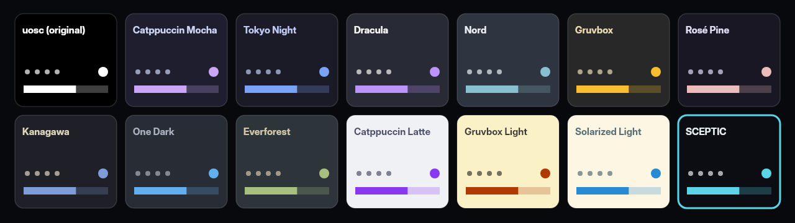

<div align="center">


[](https://github.com/SCEPTICG/hikari-mpv/releases/latest)
[](LICENSE)
[](#quick-install)
[](https://github.com/tomasklaen/uosc)

**A modern theme for the [mpv](https://mpv.io) video player, built on [uosc](https://github.com/tomasklaen/uosc).**<br>
14 colour palettes · skip openings and endings · timeline thumbnails · subtitle styles · automatic Anime4K upscaling<br>
installed with one command on Windows, macOS and Linux

[Quick install](#quick-install) · [What you get](#what-you-get) · [Screenshots](#screenshots) · [Documentation](#documentation)

</div>

hikari is a *skin* for mpv in the sense people usually mean: a ready-made, good-looking setup for watching series and anime, not a new on-screen controller written from scratch. It installs the official [uosc](https://github.com/tomasklaen/uosc) and [thumbfast](https://github.com/po5/thumbfast), configures them, and adds a few small Lua scripts of its own on top. Everything it changes in your config folder is backed up first, and it can be uninstalled.

https://github.com/user-attachments/assets/ed3f4f3a-c88e-47e5-9d99-4bc59951a60c

<sub>A one-minute showreel, drawn frame by frame in code; the Anime4K comparison is a real render in mpv. Footage and audio: *Demon Slayer: Kimetsu no Yaiba*, episode 19 © Koyoharu Gotōge / Shueisha, Aniplex, ufotable, used only to demonstrate the player. hikari is not affiliated with them.</sub>

## What you get

- **14 colour palettes**: Catppuccin Mocha and Latte, Tokyo Night, Dracula, Nord, Gruvbox (dark and light), Rosé Pine, Kanagawa, One Dark, Everforest, Solarized light, uosc's original and hikari's own, SCEPTIC. Picked from a menu (`Alt+p`) and applied straight away.
- **Skip openings and endings**: a *Saltar opening ›* button while a chapter looks like an opening, intro or ending; one click or `Alt+s` jumps to the next chapter.
- **Timeline thumbnails** through thumbfast, on network streams too.
- **Subtitle styles**: *Caja oscura* (Netflix-like box), *Borde grueso* (Crunchyroll-like outline), *Amarillo clásico*, plus size and height (`Alt+t`).
- **Anime4K upscaling**: an *Escalado* menu and `Ctrl+0`–`Ctrl+7` for [Anime4K](https://github.com/bloc97/Anime4K)'s modes, including *Automático*, which picks the mode from each video's resolution, with a quality that suits your graphics card.
- **Readable stream titles**: links from Seanime and similar apps show `Sousou no Frieren · E05` instead of a release name, with the access token kept out of the title bar.
- **Speed menu**: fixed speeds from 0.5× to 2× instead of a slider.
- **A controls bar made for single episodes**: a filled timeline with the opening and ending marked, and hikari's own buttons.
- **Update check**: a short notice and a button when a new hikari version is out. It never updates anything by itself, and it can be turned off.
- **A careful installer**: finds mpv, mpv.net and AnimeJaNai, backs up first, verifies every download against its SHA256, sets aside clashing interfaces such as ModernX, and puts everything back on uninstall.

The on-screen labels are in Spanish for now (*Saltar opening*, *Subtítulos*, *Velocidad*, *Paletas*, *Escalado*, *Actualizar hikari*). The installer speaks English or Spanish, following your system.

## Quick install

**Windows** (PowerShell, no administrator rights):

```
irm https://github.com/SCEPTICG/hikari-mpv/releases/latest/download/hikari.ps1 | iex
```

**macOS and Linux** (Terminal, no `sudo`):

```
curl -fsSL https://github.com/SCEPTICG/hikari-mpv/releases/latest/download/hikari.sh | bash
```

A menu opens: choose *Install or update* and the player. Run the same line again to update or to uninstall. Details, options and how to check the installer before running it: [Install](#install) and [macOS and Linux](#macos-and-linux).

## Screenshots

<table>
  <tr>
    <td width="50%"><br><sub><b>The player</b>: filled timeline with chapters, title bar and hikari's buttons (SCEPTIC palette).</sub></td>
    <td width="50%"><br><sub><b>Palettes</b> (<code>Alt+p</code>): 14 palettes, applied at once.</sub></td>
  </tr>
  <tr>
    <td><br><sub><b>Saltar opening ›</b>: shown during openings, intros and endings.</sub></td>
    <td><br><sub><b>Thumbnails</b> on hover, with the chapter name.</sub></td>
  </tr>
  <tr>
    <td><br><sub><b>Subtitle styles</b> (<code>Alt+t</code>): style, size and height.</sub></td>
    <td><br><sub><b>Escalado</b>: Anime4K modes, with <i>Automático</i> by resolution.</sub></td>
  </tr>
</table>

<sub>Screenshots of the real player on Linux, with <a href="https://durian.blender.org/">Sintel</a> © Blender Foundation (CC BY 3.0).</sub>

## hikari and other mpv themes

- **[uosc](https://github.com/tomasklaen/uosc)** is the on-screen controller hikari is built on. If you already use uosc, hikari is a configuration plus a few scripts on top of it, not a fork: your uosc stays the official one, and uosc's own updates keep working.
- **[ModernX](https://github.com/cyl0/ModernX) and [ModernZ](https://github.com/Samillion/ModernZ)** are other replacements for mpv's built-in OSC. They clash with uosc, so the installer sets them aside (nothing is deleted) and puts them back on uninstall.
- **mpv.net and AnimeJaNai** are supported on Windows: hikari installs into the config folder each of them reads.

## Documentation

[Requirements](#requirements) · [Install](#install) · [macOS and Linux](#macos-and-linux) · [Usage](#usage) · [Configuration](#configuration) · [Palettes](#palettes) · [Stream titles](#stream-titles) · [Speed menu](#speed-menu) · [Subtitle styles](#subtitle-styles) · [Anime4K upscaling](#anime4k-upscaling) · [Skip openings and endings](#skip-openings-and-endings) · [Update check](#update-check) · [Thumbnails](#thumbnails) · [Contributing](#contributing)

## Requirements

- **Windows** 10 or 11, **macOS** or **Linux** (the Linux installer is new and still being tested; see [macOS and Linux](#macos-and-linux)).
- Windows: a player based on mpv: [mpv](https://mpv.io/installation/), [mpv.net](https://github.com/mpvnet-player/mpv.net), or a bundle built on mpv.net such as [AnimeJaNai](https://github.com/the-database/mpv-upscale-2x_animejanai). If none is installed, the installer offers to install mpv.net with `winget`. Windows PowerShell 5.1 (built into Windows) or PowerShell 7. No administrator rights.
- macOS and Linux: [mpv](https://mpv.io/installation/) (on macOS from Homebrew or mpv.app; on Linux from your distribution, Flatpak or Snap), and `bash`, `curl` and `unzip`, which macOS and most Linux systems already have. No `sudo`.

## Install

On Windows, open PowerShell (Start menu, type *PowerShell*) and run (for macOS and Linux, see [macOS and Linux](#macos-and-linux)):

```
irm https://github.com/SCEPTICG/hikari-mpv/releases/latest/download/hikari.ps1 | iex
```

`irm` downloads the installer of the latest release and `iex` runs it. A menu opens: choose *Install or update*, then the player (or players) to install hikari for. The installer:

- finds mpv, mpv.net and AnimeJaNai and the config folder each one reads;
- backs up the files it may change, next to that folder (`<folder>-respaldo-hikari-<date>`; it keeps the three newest and the one from before the first install);
- downloads hikari, uosc and thumbfast (and Anime4K, if you want it) from GitHub, always the same versions, and checks every download against its SHA256 before using it;
- sets aside other on-screen controllers that would clash with uosc (nothing is deleted);
- copies the scripts and their settings, and adds a marked block to `mpv.conf` and `input.conf`, leaving the rest of both files as it is.

It only touches that config folder and the backup next to it, plus a temporary folder that it deletes when it ends (and, only if you choose it when no player is found, installs mpv.net with `winget`). No administrator rights, no registry, no `PATH` changes. Through `iex` it does not close or change your PowerShell window: it only leaves its result in `$LASTEXITCODE`. Messages are in Spanish when Windows is set to Spanish, in English otherwise. Restart the player afterwards.

If `irm` itself fails with an error about a secure channel (SSL/TLS), your Windows PowerShell 5.1 does not use TLS 1.2 by default (older Windows 10 builds). Switch it on for that window and run the line again:

```
[Net.ServicePointManager]::SecurityProtocol = 'Tls12'; irm https://github.com/SCEPTICG/hikari-mpv/releases/latest/download/hikari.ps1 | iex
```

- **Update**: run the same line again and choose *Install or update*. Your saved palette, subtitle and upscaling choices are kept.
- **Uninstall**: run the same line again and choose *Uninstall*. It backs up again, removes hikari and its blocks, and asks whether to remove uosc and thumbfast too and whether to put back what it set aside.

### Options

`iex` cannot pass options to the installer. To pass them, run it as a script block:

```
& ([scriptblock]::Create((irm https://github.com/SCEPTICG/hikari-mpv/releases/latest/download/hikari.ps1))) -Action uninstall
```

| Option | Meaning |
| --- | --- |
| `-Action install` / `-Action uninstall` | Skip the first menu. |
| `-Target <config folder>` | Work on that folder (several separated by `;`) instead of choosing from the list. |
| `-Yes` | No questions: take the default answer to everything. Needs `-Action`, and `-Target` when more than one folder is found. |
| `-NoMenu` | Ask with numbers and typed answers instead of the keyboard menus. |
| `-Anime4K yes` / `-Anime4K no` | Answer the Anime4K questions instead of asking: install it (and take over an Anime4K installed by hand), or leave it out. See [Anime4K upscaling](#anime4k-upscaling). |

Exit codes (in `$LASTEXITCODE`): 0 done or cancelled, 1 a folder failed, 2 wrong usage or nothing to do. For example:

```
& ([scriptblock]::Create((irm https://github.com/SCEPTICG/hikari-mpv/releases/latest/download/hikari.ps1))) -Action install -Target "$env:APPDATA\mpv" -Yes
```

### Checking the installer first

`irm ... | iex` runs whatever the server sends without checking it: the installer verifies everything it downloads, but it cannot verify itself. The address always points to a file attached to a tagged release, never to the `main` branch. To check it yourself, download `hikari.ps1` and `SHA256SUMS` from the [release page](https://github.com/SCEPTICG/hikari-mpv/releases/latest), compare the hash and run the file:

```
Get-FileHash .\hikari.ps1 -Algorithm SHA256
Get-Content .\SHA256SUMS
powershell -ExecutionPolicy Bypass -File .\hikari.ps1
```

The first line must print the hash `SHA256SUMS` lists for `hikari.ps1`. The options above work after the file name too (`-File .\hikari.ps1 -Action uninstall`). Each release's `hikari.ps1` only installs the `hikari.zip` of that same release, and only if its SHA256 matches the one written inside the script.

Be aware of what this check proves: `SHA256SUMS` comes from the same release, published by the same GitHub account, as `hikari.ps1`. It catches a file that was corrupted or changed on the way to you, but not a compromised account: whoever could replace `hikari.ps1` there could replace `SHA256SUMS` too. Reading `hikari.ps1` before running it is the only check that does not depend on the account.

From a copy of this repository (clone it, or download it as a zip and extract it), open PowerShell in that folder and run `powershell -ExecutionPolicy Bypass -File install\hikari.ps1`: the hikari files then come from that copy.

### How the installer works

<details>
<summary>Keyboard, folders, backups and every step it takes (click to open)</summary>

The installer is driven with the keyboard: `↑`/`↓` move through a menu (going past the last entry takes you back to the first), `Enter` chooses and `Esc` leaves. Where you can pick several folders, `Space` ticks or unticks each one and `Enter` confirms; with nothing ticked, `Enter` takes the highlighted folder, so with a single player found `Enter` is enough. *Other folder…* and *Exit* are entries you choose, not boxes you tick. Yes/no questions show `Yes` and `No` side by side, starting on the default answer: `←`/`→` change it, `Enter` confirms, and `Y`/`N` (`S`/`N` in Spanish) answer straight away. `Esc` (and `Ctrl+C` while a menu is open) always answers *No* or leaves, which is never the option that removes or moves anything. So `Ctrl+C` in a yes/no question answers *No* and the installation carries on: it does not stop it. Outside a menu (while it downloads or copies, or at a typed answer) `Ctrl+C` stops the script as usual. Letter shortcuts only count on their own (`Ctrl+S` or `Alt+Y` do not answer *Yes*), keys pressed before a question appears are ignored, and in the single-choice menus the old numbers still work (`1`, `2`... and `0` for *Exit*). In a window too low for a menu, the installer first draws a compact version (folders shortened on the same line, one short help line) and, if even that does not fit, asks with numbers. When there is no interactive console (input or output redirected, `-NonInteractive`, the PowerShell ISE...) the installer asks with numbers and typed answers instead, as it also does with `-NoMenu`. Typing a folder path is always a normal typed answer.

Choose *Install or update* and the installer lists the players it finds, with the config folder each one reads:

- **AnimeJaNai** (`%LOCALAPPDATA%\Programs\mpv-AnimeJaNai`) and **mpv.net**: `portable_config` next to `mpvnet.exe` if it exists, otherwise `%APPDATA%\mpv.net` (not `%APPDATA%\mpv`).
- **mpv** (in `PATH`, Scoop, Chocolatey or `Program Files\mpv`): `portable_config` next to `mpv.exe` if it exists, otherwise `%APPDATA%\mpv`.
- Existing `%APPDATA%\mpv` and `%APPDATA%\mpv.net` folders, even without a player.

Pick one or several (or, with `-NoMenu`, type their numbers: `1,3`), or type another folder (`%APPDATA%\mpv` and relative paths work). If you type the player's own folder, the one with `mpv.exe` or `mpvnet.exe`, the installer uses its `portable_config` or offers the config folder that player reads. Drive roots and your bare user folder are refused, and a folder with no sign of mpv in it (no `mpv.conf`, `input.conf`, `scripts`, `script-opts` and no mpv next to it) is only used if you confirm it; with `-Yes` it is refused. If `MPV_HOME` is set, mpv reads that folder before any `portable_config`, and so does the installer for mpv (not for mpv.net, which picks its own folder). A folder you cannot write to (a `portable_config` under `Program Files`, say) is flagged, and the installer offers the user folder instead; note that a player with a `portable_config` only reads that folder. If no player is found at all, it offers to install mpv.net with `winget` (asking first), to type a folder, or to prepare `%APPDATA%\mpv` for an mpv installed later. Ways to get mpv: <https://mpv.io/installation/>.

For each folder it:

1. Copies the files it may change to `<folder>-respaldo-hikari-<date>` next to it, and shows the size of that copy: `mpv.conf`, `input.conf`, `scripts`, `script-opts`, `fonts`, `hikari-palette.conf`, `hikari-subs.conf`, `hikari-upscale.conf`, `hikari-installed.txt`, and `scripts-desactivados`, `shaders-desactivados` and `hikari-originales` if they exist. Nothing else in the folder is copied (`cache`, `watch_later`...); in `shaders` hikari only adds and removes its own Anime4K files, and an Anime4K installed by hand is moved, never deleted, so `shaders` is not copied either. Junctions and symbolic links are skipped with a warning, never followed. If the copy fails, the half-made copy is deleted and that folder is left alone. Then only the three newest backups of that folder are kept, plus the one made before hikari's first install (the only one with your config as it was before hikari, marked with a `hikari-backup-original.txt` file inside so it is kept even after uninstalling and installing again); older ones are deleted, and the installer says which. Only folders named exactly `<folder>-respaldo-hikari-<date>` next to it count: nothing else is touched.
2. Moves other on-screen controllers that clash with uosc (ModernX, ModernZ, custom `osc.lua`, `mpv-osc-*`...) to `scripts-desactivados`, together with their `script-opts` and fonts. Nothing is deleted. It also offers to move there the `.lua` files in `scripts` that are really the error page of a failed download (first line `404: Not Found`, `Not Found` or an HTML page), for which mpv logs an error at every start; they come back on uninstall.
3. Downloads uosc 5.13.0 and thumbfast (fixed commit) from GitHub and checks their SHA256 before using them. uosc's own `uosc.conf` is not installed: hikari's is.
4. Copies the hikari scripts and `script-opts`. `hikari-palette.conf` and `hikari-subs.conf` are only copied when missing, so your saved palette and subtitle choices survive updates.
5. Anime4K: asks whether to install it (see [Anime4K upscaling](#anime4k-upscaling)) and writes `hikari-upscale.conf` if it is missing, with the quality that suits your graphics card; when it has just installed Anime4K there, in *Automático*.
6. Adds a marked block at the end of `mpv.conf` (`osc=no`, `osd-bar=no` and the three `include` lines) and of `input.conf` (`Alt+p`, `Alt+s`, `Alt+t`, `Alt+u`, and `Ctrl+0` to `Ctrl+7` when hikari installed Anime4K). The rest of both files is left as it is. Running the installer again rewrites the block: in `mpv.conf` it is moved back to the end, so the saved subtitle style still wins over `sub-*` lines you added later; in `input.conf` it stays where it is. If `mpv.conf` ends inside a `[profile]`, the block starts with `[default]`. A key you already use for something else is left to you, and the installer says so.
7. For mpv.net and AnimeJaNai, writes `mpv_path=<path to mpvnet.exe>` into `script-opts/thumbfast.conf`, because some mpv.net builds do not tell thumbfast where they are (see [Thumbnails](#thumbnails)).
8. Writes `hikari-installed.txt` with the versions installed and what was already there, for updates and uninstalling.

Run it again at any time to update. *Uninstall* (after another backup of the same files) removes the hikari scripts and options, the Anime4K shaders it installed (only those) and both blocks, and asks whether to remove uosc and thumbfast (yes by default only if hikari installed them), whether to move back what it set aside (interfaces, and an Anime4K installed by hand), whether to turn back on the `input.conf` and `mpv.conf` lines it turned off (only those, and only if they are still there as hikari left them), and whether to delete your saved choices. `hikari-update.txt`, where the update check keeps its state, goes without asking, like `hikari-installed.txt`; updating keeps it. A file that had no line break at its end gets it back that way.

If uosc goes and your own `mpv.conf` (outside the hikari block) still has `osc=no` or `osc=false`, the player would be left without on-screen controls. The installer says so and offers to move back the interfaces it set aside, or else to turn that line off by putting `# hikari: ` in front of it. With `-Yes` it only warns.

Lines you added to `mpv.conf` or `input.conf` by hand, for a copy of hikari installed without the installer, are not touched: once the installer's block is there you can delete them.

</details>

### macOS and Linux

Open Terminal and run:

```
curl -fsSL https://github.com/SCEPTICG/hikari-mpv/releases/latest/download/hikari.sh | bash
```

`curl` downloads the installer of the latest release and `bash` runs it. It is the same installer as on Windows, written for the `bash` 3.2 that comes with macOS: the same menus (`↑`/`↓`, `Enter`, `Esc`, `Space`, `Y`/`N`, `S`/`N` in Spanish), messages, backups and rotation, marked blocks, record, set-aside interfaces, Anime4K questions and uninstall (see [How the installer works](#how-the-installer-works)). The questions are read from the terminal even though the script itself comes through the pipe. Messages are in Spanish when `LC_ALL`, `LC_MESSAGES` or `LANG` (the first one set) starts with `es`, in English otherwise. What is different:

- **Config folder**. On macOS, `$MPV_HOME` if it is set, otherwise `~/.config/mpv`, the folder both Homebrew's mpv and mpv.app read. IINA keeps its own settings and is not touched (the installer says so if it finds IINA). On Linux, `$MPV_HOME` or `${XDG_CONFIG_HOME:-~/.config}/mpv` for a native mpv, plus `~/.var/app/io.mpv.Mpv/config/mpv` for the Flatpak and `~/snap/mpv/current/.config/mpv` for the Snap when those are installed; with more than one, you pick in a list.
- **No mpv**. On macOS with Homebrew it offers to run `brew install mpv` (asking first, never without questions); without Homebrew it explains how to get mpv and stops. On Linux it names the package of the usual distributions (`sudo apt install mpv`, `sudo dnf install mpv`...) and stops: it never runs `sudo` itself.
- **thumbfast**. It writes the full path of mpv (`mpv_path=/opt/homebrew/bin/mpv`, say) into `script-opts/thumbfast.conf`: an mpv started from Finder or from another app (Seanime...) does not have `/opt/homebrew/bin` in its `PATH`, and the thumbnails would come out black. Not for the Flatpak or Snap, where `mpv` inside the sandbox is the right one.
- **Graphics card**. The Anime4K quality comes from the chip on macOS (`Apple M… Pro`, `Max` and `Ultra`: *Alta*; the base M chips and Intel Macs: *Rápida*) and from `lspci` on Linux (a dedicated NVIDIA or AMD card: *Alta*; anything else, or no `lspci`: *Rápida*).
- No AnimeJaNai or mpv.net there, and no administrator questions: run it as your own user. As root (`sudo`) it warns and asks, and without questions it refuses.

Run the same line to update. To uninstall:

```
curl -fsSL https://github.com/SCEPTICG/hikari-mpv/releases/latest/download/hikari.sh | bash -s -- --uninstall
```

| Option | Meaning |
| --- | --- |
| `--install` / `--uninstall` | Skip the first menu. |
| `--target <config folder>` | Work on that folder instead of choosing from the list (repeat it for several). |
| `--yes` | No questions: take the default answer to everything (and install when no action is given). Needs `--target` when more than one folder is found. |
| `--no-menu` | Ask with numbers and typed answers instead of the keyboard menus. |
| `--anime4k yes` / `--anime4k no` | Answer the Anime4K questions instead of asking, as `-Anime4K` on Windows. |

Options go after `bash -s --`, as above. With no terminal at all (a script, `ssh` without `-t`...) it runs as with `--yes`, and when an answer is really needed (several folders and no `--target`) it stops with a clear message. Exit codes: 0 done or cancelled, 1 a folder failed, 2 wrong usage or nothing to do. The whole script is inside one function that its last line calls, so a download cut short runs nothing.

To check it before running it, download `hikari.sh` and `SHA256SUMS` from the [release page](https://github.com/SCEPTICG/hikari-mpv/releases/latest), compare `shasum -a 256 hikari.sh` (`sha256sum hikari.sh` on Linux) with the line for `hikari.sh` in `SHA256SUMS`, and run `bash hikari.sh` (the options above work after it). The same caveat as for `hikari.ps1` applies (see [Checking the installer first](#checking-the-installer-first)). From a copy of this repository, `bash install/hikari.sh` installs the hikari files of that copy.

## Usage

| Key | Action |
| --- | --- |
| `Alt+p` | Palette menu |
| `Alt+s` | Skip the current opening, intro or ending (while the button is on screen) |
| `Alt+t` | Subtitle menu (style, size, height) |
| `Alt+u` | New hikari version: release notes, update command (see [Update check](#update-check)) |
| `Ctrl+1` … `Ctrl+6` | Anime4K modes A, B, C, A+A, B+B, C+A (when hikari installed Anime4K) |
| `Ctrl+7` | Anime4K *Automático*: the mode from each video's resolution |
| `Ctrl+0` | Anime4K off |

The controls bar has up to five hikari buttons before *fullscreen*: subtitles (text icon), *Escalado* (sparkles icon, only for videos and only when Anime4K is installed), speed, palettes and *Actualizar hikari* (download icon, only when a new hikari version is out). The *Saltar opening ›* button appears at the bottom right during openings, intros and endings; click it or press `Alt+s`. A key you already use for something else is left to you: the installer says so, and you can bind another key to the same command (the commands are listed in each section below).

## Configuration

Everything lives in the player's config folder (the one the installer showed you):

| File | What it sets |
| --- | --- |
| `script-opts/uosc.conf` | uosc: timeline style and the buttons of the controls bar. |
| `script-opts/thumbfast.conf` | Thumbnails: on streams, GPU decoding, size. |
| `script-opts/hikari-skip.conf` | Skip button: which chapters, extra title patterns, position, size, opacity. |
| `script-opts/hikari-title.conf` | Stream titles: on/off and tidying of release names. |
| `script-opts/hikari-update.conf` | Update check: on/off and hours between checks. |
| `hikari-palette.conf`, `hikari-subs.conf`, `hikari-upscale.conf` | Your chosen palette, subtitle style and Anime4K mode and quality, saved by the menus. Kept on update. |

Updating hikari replaces the `script-opts` files above with hikari's (your earlier `uosc.conf` and `thumbfast.conf` are kept in `hikari-originales` and put back on uninstall), so keep a copy of any change you make to them. Your own `mpv.conf` and `input.conf` lines are never changed: only the marked hikari block is.

### Example: audio and subtitle languages

hikari does not choose languages for you. A common recipe for anime with Spanish dubs (Spanish audio when there is one, otherwise Japanese with Spanish subtitles) goes in your own `mpv.conf`, before the hikari block:

```
alang=spa,es,es-ES,ja,jpn
slang=spa,es,es-ES
subs-with-matching-audio=no
```

`alang` and `slang` list the preferred audio and subtitle languages in order; `subs-with-matching-audio=no` stops mpv from turning on subtitles in the same language as the audio. Change the codes to your languages.

## Palettes

hikari ships a palette picker for uosc. Open it with the palette button in the controls bar or `Alt+p`, then pick a palette; it is applied straight away. Each palette is a uosc colour scheme with the names you may know from your editor or terminal theme.



- Dark: uosc (original), Catppuccin Mocha, Tokyo Night, Dracula, Nord, Gruvbox, Rosé Pine, Kanagawa, One Dark, Everforest.
- Light: Catppuccin Latte, Gruvbox light, Solarized light.
- Custom: SCEPTIC, defined in `portable_config/scripts/hikari-palettes.lua`.

A palette can also set transparency through an optional `opacity` table (uosc's `opacity` keys, values 0 to 1); palettes without it use uosc's default opacity.

hikari owns uosc's `color` and `opacity` options: values set in `script-opts/uosc.conf` are overridden by the active palette. Customise them by editing a palette instead.

The choice is saved to `~~/hikari-palette.conf` (the mpv config folder, `portable_config/` in a portable install), which `mpv.conf` includes on start-up. To bind another key, use `script-binding hikari_palettes/open-menu` in `input.conf`.

## Stream titles

When mpv plays an http(s) URL with a query string, such as the links Seanime hands out (`https://host/<id>?token=...&filename=Show.S01E01.mkv`), `hikari-title.lua` sets the title to the decoded `filename` parameter without its video extension, or to the last path segment when there is no `filename`. The title is set as the file starts, so the token is kept out of the top bar except, at most, for an instant while the stream opens. Local files and URLs without a query keep mpv's own title, and a `force-media-title` you set yourself is left alone. The title only lasts for that file.

It also leaves alone playlist entries that carry their own title (M3U `#EXTINF`), and when there is no `filename` the path segment it falls back to (`stream`, `master.m3u8`...) gives way to the file's own `title` tag once the file has loaded.

Scope: this covers uosc's top bar and the window title. The full URL is still visible in uosc's playlist menu, in mpv's stats overlay, and in mpv's logs and `watch_later` files.

With `pretty=yes` (the default) a title taken from `filename` is tidied up: dots and underscores become spaces, release groups, hashes and technical tags go, and the episode marker is shown as `T<season> E<episode>` (T for *temporada*, season):

| `filename` | Title |
| --- | --- |
| `Reborn.as.a.Space.Mercenary.I.Woke.Up.Piloting.the.Strongest.Starship.S01E01.1080p.CR.WEB-DL.DUAL.AAC2.0.H.264.MSubs-ToonsHub.mkv` | `Reborn as a Space Mercenary I Woke Up Piloting the Strongest Starship · T1 E01` |
| `[SubsPlease] Sousou no Frieren - 05 (1080p) [ABCD1234].mkv` | `Sousou no Frieren · E05` |
| `Show.S01E01-E02.mkv` | `Show · T1 E01-E02` |
| `Show.S00E03.mkv` | `Show · Especial E03` (season 0 holds the specials) |
| `Movie.Name.2023.1080p.BluRay.x264.mkv` | `Movie Name (2023)` |

Recognised markers: `S01E01`, `s1e1`, `S01E01v2`, `S01E01-E02`, `E01`, `EP01`, `Episode 01` and anime-style ` - 01` / ` - 01v2`. A name with no marker is treated as a film and only cut at its first technical tag (resolution, source, codec, audio...); if nothing sensible is left, the name is shown as it comes. The path-segment fallback and playlist titles are never changed. A name written all in lower case, as some groups do (Erai-raws calls one series just `jukishi`), gets a capital first letter (`Jukishi · E15`); a name with any capital letter is left as it was written. Only the filename is available: the full series title (which Seanime knows) is not passed to mpv. Set `pretty=no` to get the filename as it comes, without its video extension.

Disable the whole script with `enabled=no` in `script-opts/hikari-title.conf`.

## Speed menu

The speed button in the controls bar opens a menu with 0.5×, 0.75×, 1×, 1.25×, 1.5× and 2×; the current speed is marked. mpv's own `[`, `]` and `Backspace` keep working. To open the menu from the keyboard, add a line like this to `input.conf`:

```
Alt+v  script-binding hikari_speed/open-menu
```

## Subtitle styles

The subtitles button with the text icon (`text_fields`) in the controls bar, or `Alt+t`, opens a **Subtítulos** menu with three groups. Picking an option applies it straight away and the menu stays open, with the new choice marked, so several things can be adjusted in a row.

- **Style**: *Original* (sets nothing: mpv's defaults or your own `sub-*` lines in `mpv.conf`), *Caja oscura* (white text on a translucent black box, Netflix-like), *Borde grueso* (bold white text, thick black outline, soft shadow, Crunchyroll-like) and *Amarillo clásico* (yellow text, black outline and shadow).
- **Size**: `sub-scale` 0.85, *Normal*, 1.2 or 1.4.
- **Height**: `sub-pos` *Normal*, 95 or 90.

*Original* and *Normal* set nothing, so whatever your `mpv.conf` says (or mpv's default: `sub-scale=1`, `sub-pos=100`) stays in charge. Choosing them again puts back the values mpv had when the script started; if mpv was started with another choice saved, those values were already the choice's, so mpv's built-in defaults are used instead until the next start, when your `mpv.conf` applies again.

The choice is saved to `~~/hikari-subs.conf`, which `mpv.conf` includes on start-up. The styles are defined in `portable_config/scripts/hikari-subs.lua`. Colours use mpv's `#AARRGGBB`, where the alpha is opacity (`FF` opaque, `00` invisible), the reverse of ASS. To bind another key, use `script-binding hikari_subs/open-menu` in `input.conf`.

ASS subtitles keep their own styling: hikari leaves mpv's `sub-ass-override=scale` alone, so the style only applies to text subtitles (SRT, WebVTT...). With that setting mpv still applies `sub-scale` to ASS, so the size options do change them. `sub-pos` is passed to libass as the line position and moves ASS dialogue too; lines placed with `\pos` (signs, karaoke) should stay where they are. This last point still has to be checked in mpv with real files.

mpv 0.39 changed the subtitle border options, and the script adapts to the version it runs on, always writing the real option name (never an alias):

- mpv 0.39 and newer: `sub-outline-color`/`sub-outline-size`, `sub-back-color` for the shadow colour (`sub-shadow-color` is an alias of it), and `sub-border-style`. *Caja oscura* uses `sub-border-style=opaque-box`.
- mpv 0.38 and older: `sub-border-color`/`sub-border-size`, a separate `sub-shadow-color`, and no `sub-border-style`. *Caja oscura* still gets its box: a translucent `sub-back-color` makes mpv draw a background box in that colour. The other styles never give `sub-back-color` any opacity of their own (they put back the value it had at start-up), so no box appears with them.

A `hikari-subs.conf` written by mpv 0.39 or newer uses option names that mpv 0.38 and older don't know: if the same config folder is used with an older mpv, it logs an unknown-option error for those lines and starts normally, without that style until it is picked again.

## Anime4K upscaling

[Anime4K](https://github.com/bloc97/Anime4K) (by bloc97, MIT) is a set of mpv shaders that clean up and upscale anime on the graphics card. hikari does not include it: the installer downloads release v4.0.1 (`Anime4K_v4.0.zip`) from GitHub, checks its SHA256 and copies its `Anime4K_*.glsl` files, and nothing else, into `shaders/`. Once installed it starts in **Automático** (see below); pick another mode, or *Apagado*, at any time.

The **Escalado** button in the controls bar (sparkles icon, `auto_awesome`) opens a menu with two groups; picking an option applies it straight away and the menu stays open:

- **Modo**: *Apagado*, *Automático* and Anime4K's six official modes. *Automático* picks the mode from the height of each video, with the chosen quality: C up to 576 lines (480p, 576p), B up to 810 (720p), A+A up to 1100 (1080p), and no shaders for taller videos (1440p, 4K), which do not need upscaling. It works it out again for every file (and whenever the height changes), so a playlist that mixes resolutions gets the right mode for each one. The guide of Anime4K says the right mode is the one that looks best; roughly:

  | Mode | For |
  | --- | --- |
  | A | Most 1080p anime, blurry or with compression artifacts. |
  | B | Most 720p anime (and 1080p scaled down to 720p): less blur, more aliasing and ringing. |
  | C | SD (480p) without much damage, wallpapers and clean images. |
  | A+A, B+B, C+A | The same, sharper and slower. Only for scaling by 2× or more (720p and below on a 1080p screen). |

- **Calidad**: *Alta* (Anime4K's *HQ* shader lists, for capable graphics cards) or *Rápida* (its *Fast* lists).

`Ctrl+1` to `Ctrl+6` pick the modes in the same order and `Ctrl+0` turns Anime4K off, as in Anime4K's own instructions; `Ctrl+7` is *Automático*. Each shows a short message such as *Anime4K: Modo A (Rápido)* or *Anime4K: Automático (B, 720p)*. The shader lists are exactly those of Anime4K's official mpv templates. If the shaders are missing, the menu says so (*Anime4K no está instalado: ejecuta el instalador*) and the button stays hidden.

The choice is saved to `~~/hikari-upscale.conf`, which `mpv.conf` includes, so a fixed mode is active from the first frame on the next start. With *Apagado* that file sets no `glsl-shaders` at all, so your own `glsl-shaders` line keeps working; with a mode on, the mode's Anime4K shaders replace the whole list (like Anime4K's own keys do), and *Apagado* puts your list back. *Automático* cannot know the height before a file is open, so its file only says `mode=auto`: the script sets the shaders when each file loads, and with no mode for a video (too tall, or no video) your own list applies, as with *Apagado*. The shader list is set as a list, never as one joined string, so it does not depend on the path separator (`;` on Windows, `:` elsewhere). The button needs mpv 0.36 or newer (it is shown through a `user-data` property); with an older mpv use the keys.

What the installer does:

- **AnimeJaNai**: nothing. It already upscales with AI and uses `Ctrl+1` to `Ctrl+9` for it.
- **No Anime4K yet**: it explains what it is and asks *Install Anime4K?* (yes by default; with `-Yes`, yes). Installed, it starts in *Automático*: `hikari-upscale.conf` is written with `mode=auto` and the quality for your card, even if an earlier one said *Apagado*. If you say no, it asks again on the next update, then with no as the default. If the download or its check fails, the installer says so and installs the rest of hikari; Anime4K is offered again next time, yes by default.
- **Already installed by hikari**: an update leaves it alone when it is the same version and every shader hikari needs is there; if one is missing or the version changed, it is downloaded and installed again. The mode you chose is kept.
- **Anime4K installed by hand** (`Anime4K_*.glsl` in `shaders/` that hikari did not put there): it offers to take it over (no by default; with `-Yes`, no). If you accept, hikari first downloads and checks its copy (if that fails, nothing of yours is touched), then your files are moved to `shaders-desactivados/` (nothing is deleted), hikari installs its own copy (in *Automático*), and `Ctrl+0` to `Ctrl+6` lines of yours that change `glsl-shaders` (`CTRL+1` and `Ctrl+1` alike) can be turned off by putting `# hikari: ` in front of them, so the hikari keys can use those keys. A `glsl-shaders=` line with Anime4K shaders in your `mpv.conf` (Anime4K's templates have one; so do `[profile]`s that pick a mode by height, which *Automático* replaces) is turned off the same way (yes by default, and with `-Yes`): otherwise that mode would be on at every start, even with *Apagado*. The same happens if hikari installs Anime4K where such a line was already waiting for the shaders. Uninstalling moves your files back and turns those lines on again. If you do not accept, nothing is touched: your keys keep working, but the *Escalado* menu does not know what they turned on.
- `-Anime4K yes` installs it (and takes over one installed by hand) without asking; `-Anime4K no` leaves it out (an Anime4K that hikari installed earlier is left as it is).

The quality is chosen from your graphics card the first time `hikari-upscale.conf` is written, and the installer says so in one line (*Gráfica: NVIDIA GeForce RTX 3060 → calidad Alta*). When there are several cards, the most capable one decides. The line follows [Anime4K's own guide](https://github.com/bloc97/Anime4K/blob/master/md/GLSL_Instructions_Windows_MPV.md), which puts GTX 1080, RTX 2070, RTX 3060, RX 590, Vega 56, 5700 XT and 6600 XT among the higher-end cards and GTX 980, GTX 1060 and RX 570 among the lower-end ones; a card that is not clearly as fast as an RTX 2070 gets *Rápida*:

| | *Alta* | *Rápida* |
| --- | --- | --- |
| NVIDIA | GTX 1080 / 1080 Ti; RTX 2070 and up; RTX 3060, 4060, 5060 and up; TITAN Xp / V / RTX; professional RTX 4000 and up | GTX 1070, GTX 16xx, GTX 1060 and older; RTX 2060 (Super too); RTX 3050, 4050, 5050; RTX A2000 and smaller; MX, GT |
| AMD | RX 590; RX 5600, 5700; RX 6600 and up; RX 7600 and up; RX 9060 and up; RX Vega 56/64, Radeon VII | RX 580, 570 and older; RX 5500; RX 6400, 6500; RX 7400; integrated graphics (*Radeon Graphics*, *780M*...) |
| Intel | Arc A580, A750, A770, B570, B580 (and A770M) | *Arc Graphics* with no model number and Arc 140V (integrated in Core Ultra), Arc A380, laptop Arc below A770M, UHD, Iris, HD |
| Apple | M Pro, Max and Ultra | M base chips, Intel Macs |
| Linux (`hikari.sh`, from `lspci`) | a dedicated NVIDIA or AMD card | Intel, AMD integrated, no `lspci` |
| Other | | anything unknown |

It never changes the quality you picked afterwards: change it in the menu at any time. If the video stutters, use *Rápida* or a mode without `+`.

The modes, qualities and shader lists are defined in `portable_config/scripts/hikari-upscale.lua`. To open the menu from the keyboard, bind `script-binding hikari_upscale/open-menu` in `input.conf`; to pick a mode, `script-message-to hikari_upscale set-mode <off|auto|a|b|c|aa|bb|ca>` (and `set-quality <hq|fast>`).

## Skip openings and endings

`hikari-skip.lua` shows a **Saltar opening ›** / **Saltar ending ›** button at the bottom right, above uosc's controls, for as long as playback is inside a chapter that looks like an opening or an ending, even when uosc's controls are hidden or playback is paused. Clicking it, or pressing `Alt+s`, jumps to the start of the next chapter. Outside those chapters, in files without chapters, while idle and while a uosc menu or the console is open, nothing is drawn and the mouse is left to uosc and mpv.

Chapters are recognised by title, with the same rules uosc uses to colour its chapter ranges: `OP`, `Opening`, `... OP`, `... Opening` and `オープニング` for openings (only when another chapter follows), `ED`, `Ending`, `ED ...`, `Ending ...`, `... ED`, `... Ending`, `Credits`, `Credits ...`, `... Credits` and `エンディング` for endings. Titles such as `Operation`, `OP1` or `Opening Night` do not count; add your own patterns with `extra_openings` / `extra_endings` (Lua patterns separated by `|`, matched against the lower-case title). Intros (`Intro`, `Avant`, `Prologue`, shown as **Saltar intro ›**) are on by default, because many releases name the opening song `Intro`; turn them off with `intros=no`. Outros (`Outro`, `Closing`, `Preview`, `PV`, shown as **Saltar avance ›**) are off by default; turn them on with `outros=yes`.

When the ending is the last chapter, skipping it moves on to the next playlist entry if there is one; otherwise it seeks to one second before the end, so the file finishes as it normally would.

The button follows the active palette (background and border from uosc's `background` and `foreground`, filled with `foreground` on hover). Position, size and opacity are set in `script-opts/hikari-skip.conf`. To use another key, bind `script-binding hikari_skip/skip` in `input.conf`.

## Update check

`hikari-update.lua` tells you when a new version of hikari is out. It only tells you: it never downloads or installs anything by itself.

When there is one, opening a file shows *hikari 0.4.1 disponible · Alt+u* for a few seconds, and an *Actualizar hikari* button (download icon) appears in the controls bar, before *fullscreen*. The button, or `Alt+u`, opens a menu with:

- **Ver novedades de la 0.4.1**: opens that version's release page on GitHub in your browser.
- **Copiar comando de actualización**: copies the update command, the same one as in [Install](#install): `irm https://github.com/SCEPTICG/hikari-mpv/releases/latest/download/hikari.ps1 | iex` on Windows (paste it into PowerShell), `curl -fsSL https://github.com/SCEPTICG/hikari-mpv/releases/latest/download/hikari.sh | bash` on macOS and Linux (paste it into a terminal). If the clipboard cannot be reached, the command is shown on screen to type it by hand.
- **No avisar de esta versión**: no more notice or button for that version. The next one is announced as usual, and `Alt+u` still opens the menu.

How it checks: on the first file you open after starting mpv (never at start-up, so nothing waits for it), and at most once a day, hikari runs `curl` in the background to ask `https://github.com/SCEPTICG/hikari-mpv/releases/latest` where it points, and reads the version from the answer. That is the only request: no GitHub API, no account, nothing about you or your files is sent beyond what any visit to that page sends (your IP address and curl's name). Without `curl` or without network nothing is shown, and it tries again the next day. The installed version comes from `hikari-installed.txt`, which the installer writes; a copy installed by hand or from the repository (`dev`) is never checked. The time of the last check, the latest version found and the one you dismissed are kept in `hikari-update.txt` in the config folder. If that file cannot be written (a read-only config folder), it still asks only once per mpv session, but every new session asks again. On Windows it runs `curl.exe` (and, from the menu, `cmd.exe`, `clip.exe` and PowerShell) only from the `System32` folder of Windows, never from mpv's folder or the video's.

It is on by default. To turn it off, set `enabled=no` in `script-opts/hikari-update.conf`; updating hikari replaces that file, so to keep it off for good add this line to your own `mpv.conf` instead (outside the hikari block):

```
script-opts-append=hikari-update-enabled=no
```

`interval_hours` in the same file sets the hours between checks (24 by default, at least 1). To use another key, bind `script-binding hikari_update/open-menu` in `input.conf`.

## Thumbnails

Timeline thumbnails come from [thumbfast](https://github.com/po5/thumbfast), which uosc picks up automatically. thumbfast is not bundled (MPL-2.0); install `thumbfast.lua` into `scripts/` (the installer will do it). hikari ships `script-opts/thumbfast.conf` with thumbnails enabled on network streams (`network=yes`), GPU decoding (`hwdec=yes`) and the thumbnailer started only when the timeline is first hovered (`spawn_first=no`). On streams thumbfast opens its own connection, so it uses some extra bandwidth and the first thumbnail can take a moment. mpv.net 7+ is meant to work without extra setup, but some builds (seen with the AnimeJaNai bundle, mpv.net 7.1.2) do not report their path to thumbfast in time and it shows "install standalone mpv". In that case add the full path to `script-opts/thumbfast.conf`, e.g. `mpv_path=C:\Users\<you>\AppData\Local\Programs\mpv-AnimeJaNai\mpvnet.exe` (the installer will write it for you). On macOS the installer always writes it (`mpv_path=/opt/homebrew/bin/mpv`, say): mpv started from Finder or another app does not find `mpv` in its `PATH`, and the thumbnails come out black. On streams each new thumbnail takes a moment, since thumbfast has to fetch that part of the video over the network.

## Contributing

Issues and pull requests are welcome on [GitHub](https://github.com/SCEPTICG/hikari-mpv).

Running the tests and making a release: [docs/development.md](docs/development.md).

## Credits

- [uosc](https://github.com/tomasklaen/uosc) by tomasklaen, LGPL-2.1.
- [thumbfast](https://github.com/po5/thumbfast) by po5, MPL-2.0.
- [Anime4K](https://github.com/bloc97/Anime4K) by bloc97, MIT.

None of them is included in this repository: the installer downloads them from their official sources (uosc 5.13.0, a fixed thumbfast commit and Anime4K v4.0.1, the last only if you want it) and checks their SHA256.

Screenshots: [Sintel](https://durian.blender.org/) © Blender Foundation, CC BY 3.0.

## License

MIT, see [LICENSE](LICENSE).
